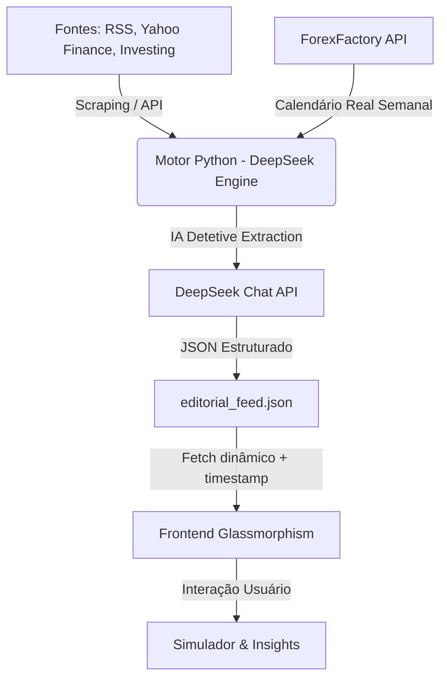

# 📈 Trilha dos Juros - Terminal de Inteligência Financeira Premium

**Trilha dos Juros** evoluiu de um simulador para um **terminal de inteligência financeira completo**. Projetado com a estética *Faria Lima Style* (Glassmorphism), o sistema agora combina cálculos matemáticos rigorosos de renda fixa com análise editorial em tempo real impulsionada por Inteligência Artificial.

---

## 💎 Diferenciais Estratégicos (Next-Gen)

### 1. Hub Editorial Autônomo (DeepSeek Engine v2.0)
O sistema opera com uma arquitetura de IA de alta performance para garantir análises profundas e estáveis:
- **Motor Exclusivo (DeepSeek):** Utilizado para gerações de alta performance, textos densos e análise profunda, operando via API paga para estabilidade total.
- **Morning Call, Coffee Break e Resumo do Dia:** Três turnos de análise diária automática, cobrindo abertura, meio-dia e fechamento de mercado.
- **Compliance CVM:** Todo conteúdo é estritamente informativo, eliminando adjetivos sensacionalistas ou recomendações de compra/venda.

### 2. Agenda Econômica com "IA Detetive"
Uma interface de monitoramento em tempo real centrada no investidor de Renda Fixa:
- **IA Detetive:** O motor editorial não apenas lê a agenda, mas "caça" valores reais nas notícias. Se um dado (ex: IPCA ou CPI) sair no Yahoo Finance, a IA extrai o número e preenche o campo **ATUAL** do Radar instantaneamente.
- **Neon Pulse Indicators:** Eventos de alto impacto (CPI, FOMC, Copom) ganham destaque visual dinâmico.
- **Filtro Inteligente:** O radar prioriza automaticamente eventos de "Hoje em diante", eliminando a poluição de dados passados.

### 3. Precisão Matemática Impecável
Nosso motor de cálculo (JS Nativo) processa o rigor financeiro que calculadoras comuns ignoram:
- **Tabela Regressiva de IR:** Descontos automáticos de 22.5% a 15% conforme o prazo.
- **Calendário B3:** Cálculos baseados no padrão de 252 dias úteis.
- **Isenções Inteligentes:** Tratamento automático para LCI, LCA e Poupança.

### 4. Orquestração de Dados Resiliente
Arquitetura híbrida que garante 99.9% de disponibilidade:
- **Indicadores Oficiais:** Selic, CDI e IPCA via API do Banco Central.
- **Ações & Commodities:** Roteamento via Vercel Serverless Function e Python Scrapers persistidos para alta resiliência.

---

## 🏗️ Arquitetura de Fluxo de Dados

---

## 🛠️ Stack Tecnológica

- **Front-end:** Vanilla JavaScript (ES6+), CSS3 (Dark Mode & UI Premium), HTML5 Semântico.
- **AI Engine:** Python 3.11 + DeepSeek API (OpenAI SDK).
- **Backend Edge:** Node.js em Vercel Serverless Functions.
- **Visualização:** Chart.js para gráficos de juros compostos.
- **Segurança:** Proteção contra XSS, DDoS e arquitetura **Clean-Secret** (GitHub Secrets).

---

## 🚀 Como Visualizar
O ecossistema em produção máxima blindada pode ser acessado em: [trilhadosjuros.com.br](https://trilhadosjuros.com.br)

---

## 🖋️ Autoria e Metodologia
Desenvolvido sob o padrão **Skill Senior Workflow**. Este projeto não é apenas código; é uma solução de engenharia financeira que prioriza UX premium, automação total e resiliência de dados.

---
© 2026 Trilha dos Juros. Todos os direitos reservados.
