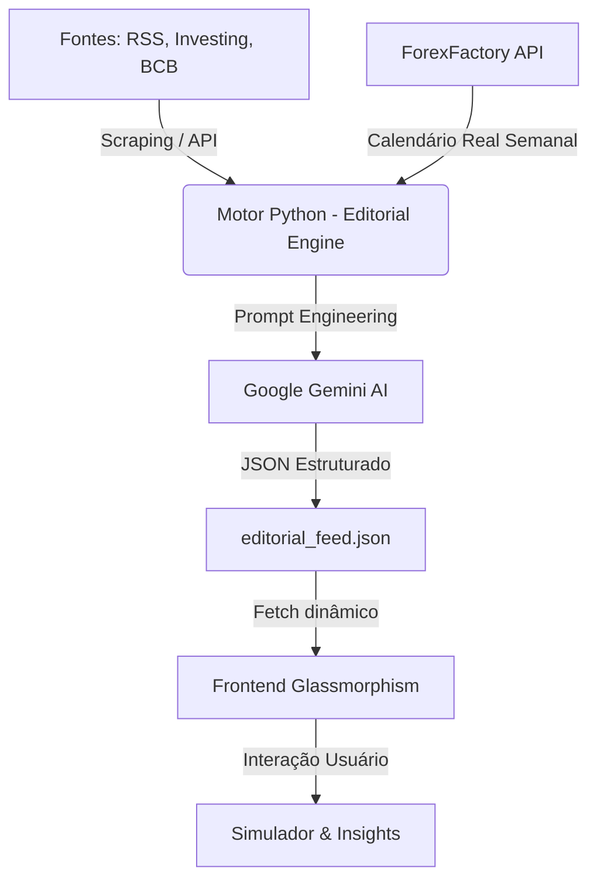

# 📈 Trilha dos Juros - Terminal de Inteligência Financeira Premium

**Trilha dos Juros** evoluiu de um simulador para um **terminal de inteligência financeira completo**. Projetado com a estética *Faria Lima Style* (Glassmorphism), o sistema agora combina cálculos matemáticos rigorosos de renda fixa com análise editorial em tempo real impulsionada por Inteligência Artificial.

---

## 💎 Diferenciais Estratégicos (Next-Gen)

### 1. Hub Editorial Autônomo (AI-Powered)
O sistema não apenas calcula, ele interpreta o mercado. Utilizando o motor **Google Gemini**, o hub gera autonomamente:
- **Morning Call:** Preparação estratégica antes da abertura do mercado.
- **Coffee Break:** Resumo dinâmico dos principais movimentos do meio-dia.
- **Resumo do Dia:** Análise de fechamento com os fatos que realmente importam.
- **Compliance CVM:** Todo conteúdo é estritamente informativo, eliminando adjetivos sensacionalistas ou recomendações de compra/venda.

### 2. Agenda Econômica de Alto Impacto (Dados Reais)
Uma interface de monitoramento em tempo real centrada no investidor de Renda Fixa:
- **Fonte Real:** Eventos consumidos da API do **ForexFactory** (JSON semanal), eliminando dados fictícios gerados pela IA.
- **Neon Pulse Indicators:** Eventos de alto impacto (CPI, FOMC, Copom) ganham destaque visual dinâmico.
- **Análise Brasileira e Global:** Cobertura simultânea dos principais indicadores do Brasil (BCB) e Estados Unidos (Fed).
- **Dados Preditivos:** O motor de IA injeta as projeções de mercado (Proj) vs valores anteriores (Prev) para auxiliar na tomada de decisão.
- **Fallback Resiliente:** Se a API do Gemini atingir limite de quota (429), os dados existentes são preservados integralmente.

### 3. Precisão Matemática Impecável
Nosso motor de cálculo (JS Nativo) processa o rigor financeiro que calculadoras comuns ignoram:
- **Tabela Regressiva de IR:** Descontos automáticos de 22.5% a 15% conforme o prazo.
- **Calendário B3:** Cálculos baseados no padrão de 252 dias úteis.
- **Isenções Inteligentes:** Tratamento automático para LCI, LCA e Poupança.

### 4. Orquestração de Dados Resiliente
Arquitetura híbrida que garante 99.9% de disponibilidade:
- **Indicadores Oficiais:** Selic, CDI e IPCA via API do Banco Central.
- **Ações & Commodities:** Roteamento via Vercel Serverless Function e Python Scrapers salvos em GitHub Gists para contornar timeouts de FTP.

---

## 🏗️ Arquitetura de Fluxo de Dados

---

## 🛠️ Stack Tecnológica

- **Front-end:** Vanilla JavaScript (ES6+), CSS3 (Dark Mode & UI Premium), HTML5 Semântico.
- **AI Engine:** Python 3.10 + Google Generative AI (Gemini Flash).
- **Backend Edge:** Node.js em Vercel Serverless Functions.
- **Visualização:** Chart.js para gráficos de juros compostos.
- **Segurança:** Proteção contra XSS, DDoS e arquitetura **Clean-Secret** (Credenciais armazenadas em GitHub Secrets/Vault).

---

## 🚀 Como Visualizar
O ecossistema em produção máxima blindada pode ser acessado em: [trilhadosjuros.com.br](https://trilhadosjuros.com.br)

---

## 🖋️ Autoria e Metodologia
Desenvolvido sob o padrão **Skill Senior Workflow**. Este projeto não é apenas código; é uma solução de engenharia financeira que prioriza UX premium, automação total e resiliência de dados.

---
© 2026 Trilha dos Juros. Todos os direitos reservados.
